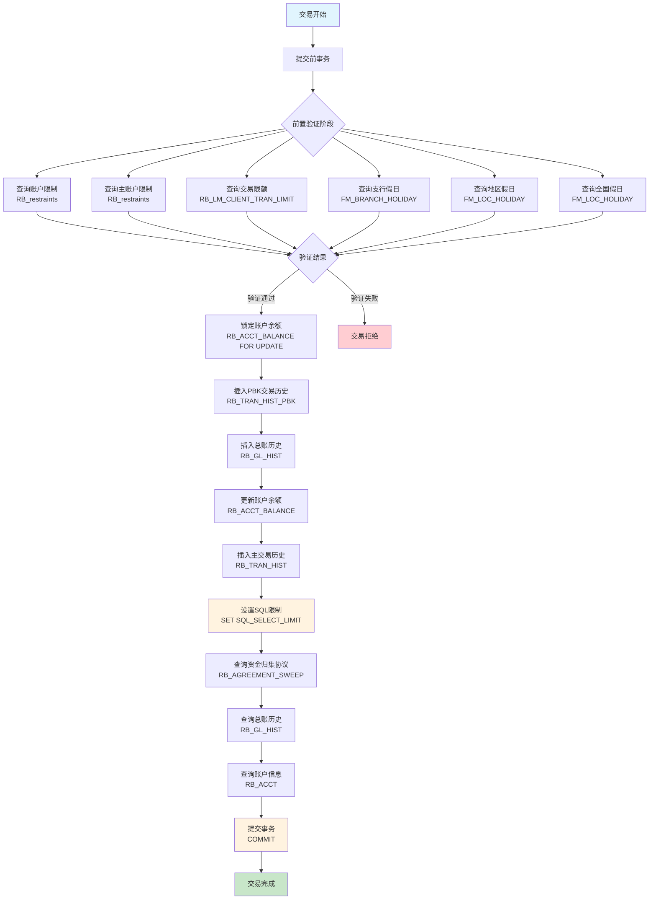
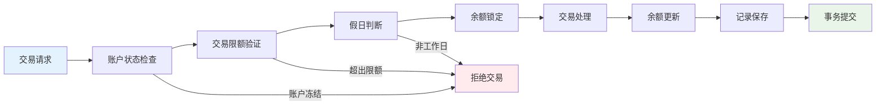
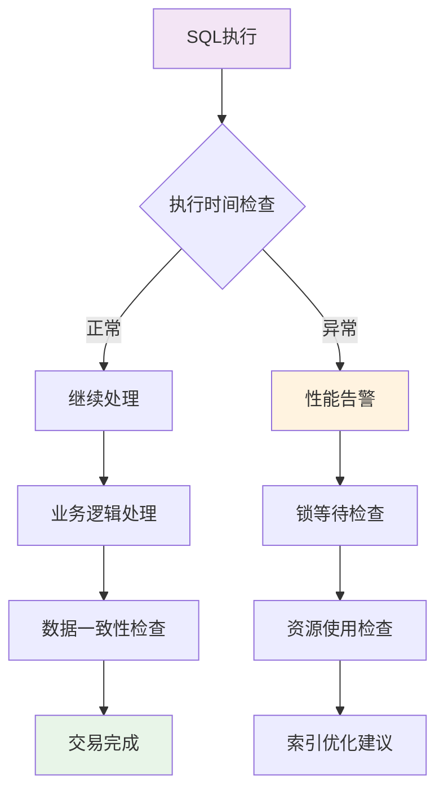
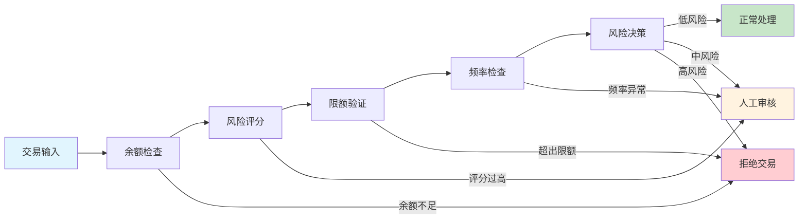
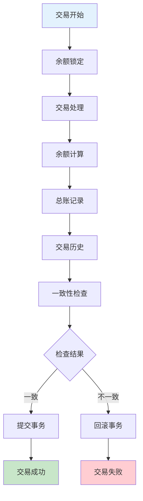

# 台州银行生产问题分析

## 一、SQL语句提取与业务逻辑

### 1. 统计分段SQL
```sql
SELECT MIN(KEY_FIELD) AS SEGMENT_START, MAX(KEY_FIELD) AS SEGMENT_END, COUNT(1) AS SEGMENT_ROW_COUNT
FROM (
    SELECT KEY_FIELD, @rownum := @rownum + 1 AS rowcount
    FROM (
        SELECT SEQ_NO AS KEY_FIELD
        FROM (
            SELECT ... FROM rb_tran_hist WHERE ... 
            UNION ALL
            SELECT ... FROM RB_COMMON_ACCOUNT_HIST WHERE ...
        ) t1
        WHERE SEQ_NO BETWEEN '133968' AND '137521'
    ) t1, (SELECT @rownum := -1) t
    ORDER BY t1.key_field
) tt
GROUP BY floor(tt.rowcount / 1000)
```
**业务逻辑**：对交易流水在指定SEQ_NO区间内的数据，分段统计每1000条的起止SEQ_NO和数量，用于大批量数据的分段处理或校验。

---

### 2. 查询约束信息
```sql
SELECT INTERNAL_KEY, RESTRAINT_TYPE, ... FROM RB_restraints
WHERE INTERNAL_KEY = 2000952333 AND SUB_RESTRAINT_CLASS = ...
```
**业务逻辑**：查询客户在RB_restraints表中的约束信息，判断账户是否被冻结、受限等。

---

### 3. 查询客户限额
```sql
SELECT BASE_ACCT_NO, ACCT_CCY, ACCT_SEQ_NO, ... FROM RB_LM_CLIENT_TRAN_LIMIT
WHERE LIMIT_REF = 'RcNotMtTransferLimitPd'
  AND CLIENT_NO = '1108803572'
  AND BASE_ACCT_NO = '110880357200069'
```
**业务逻辑**：查询客户某账户的转账限额，用于风控、额度校验。

---

### 4. 查询分支行节假日
```sql
SELECT BRANCH, HOLIDAY_TYPE, ... FROM FM_BRANCH_HOLIDAY
WHERE BRANCH = '0503' AND HOLIDAY_DATE = '2025-07-07'
```
**业务逻辑**：判断某分支行在指定日期是否为节假日，影响业务处理日历。

---

### 5. 查询账户余额（加锁）
```sql
SELECT INTERNAL_KEY, TOTAL_AMOUNT, ... FROM RB_ACCT_BALANCE
WHERE INTERNAL_KEY = 2003879425 AND CLIENT_NO = '1108803572'
FOR UPDATE
```
**业务逻辑**：查询并锁定账户余额，防止并发修改，常用于转账、冲正等资金变动场景。

---

### 6. 插入交易流水
```sql
INSERT INTO RB_TRAN_HIST_PBK (...) VALUES (...)
```
**业务逻辑**：记录一笔交易流水，涉及账户、金额、交易类型等，核心账务操作。

---

### 7. 更新账户余额
```sql
UPDATE RB_ACCT_BALANCE
SET INTERNAL_KEY = 2003879425, TOTAL_AMOUNT = -83986.57, ...
WHERE INTERNAL_KEY = 2003879425 AND CLIENT_NO = '1108803572'
```
**业务逻辑**：更新账户余额，反映资金变动，通常与流水插入配套。

---

### 8. 插入主流水
```sql
INSERT INTO RB_TRAN_HIST (...) VALUES (...)
```
**业务逻辑**：主账流水插入，记录完整的交易明细，便于后续对账、冲正、稽核。

---

### 9. 查询协议、GL流水、账户等
```sql
SELECT ... FROM RB_AGREEMENT_SWEEP WHERE ...
SELECT ... FROM RB_GL_HIST WHERE ...
SELECT ... FROM RB_ACCT WHERE ...
```
**业务逻辑**：查询协议、总账流水、账户信息，辅助业务处理和校验。

---

## 二、业务流程与故障点分析

### 1. 冲正交易的典型流程
- 锁定账户余额（SELECT ... FOR UPDATE），防止并发资金变动。
- 校验账户状态、额度、约束、节假日等业务规则（多表SELECT）。
- 插入冲正流水（INSERT INTO RB_TRAN_HIST_PBK / RB_TRAN_HIST）。
- 更新账户余额（UPDATE RB_ACCT_BALANCE）。
- 插入总账流水（INSERT INTO RB_GL_HIST）。
- 提交事务（commit）。

### 2. 可能的故障点
- 并发冲突：FOR UPDATE锁未能及时释放，导致死锁或等待。
- 数据不一致：流水插入成功但余额未更新，或反之。
- 约束/额度校验失败：如账户被冻结、额度不足等。
- 节假日校验：业务日历判断错误导致交易被拒绝。
- 主从延迟/锁表：高并发下主从同步延迟或表被长事务锁定。

---

## 三、结论与建议

1. 本次冲正交易涉及多表校验、加锁、流水插入和余额更新，流程复杂，任何一步异常都可能导致冲正失败。
2. 建议重点排查：
   - 相关表的锁等待和死锁日志（如InnoDB status）。
   - 事务提交前后各表数据一致性。
   - 业务校验逻辑（如额度、约束、节假日）是否有误。
   - 数据库慢查询和资源瓶颈。
3. 如有具体报错或异常堆栈，请补充，有助于进一步定位问题。 

---

## 四、数据不一致问题分析与排查建议

### 1. 可能出错的步骤分析

根据日志和SQL，冲正交易的核心步骤为：
1. 锁定账户余额（SELECT ... FOR UPDATE）
2. 校验业务规则
3. 插入流水（INSERT INTO RB_TRAN_HIST_PBK / RB_TRAN_HIST）
4. 更新余额（UPDATE RB_ACCT_BALANCE）
5. 插入总账流水（INSERT INTO RB_GL_HIST）
6. 提交事务（commit）

**数据不一致常见场景：**
- 流水插入成功但余额未更新：可能在插入流水后，更新余额SQL未执行或执行失败，或事务未提交。
- 余额已更新但流水未插入：可能在更新余额后，流水插入SQL未执行或执行失败，或事务未提交。
- 事务中间出错导致部分SQL已执行，部分未执行，最终回滚或未回滚。

### 2. 深入排查方向与方法

#### （1）排查事务完整性
- 检查相关业务代码或存储过程，确认流水插入和余额更新是否在同一事务内。
- 检查数据库日志，确认commit/rollback是否正常。
- 检查是否有异常导致事务提前终止或回滚。

#### （2）排查SQL执行结果
- 查看流水表和余额表的操作日志，确认每条SQL的执行结果（如affect_num、resultcode等字段）。
- 检查是否有SQL执行报错、超时、死锁等异常。

#### （3）排查并发与锁冲突
- 查看InnoDB status，排查是否有锁等待、死锁，导致部分SQL未能及时执行。
- 检查是否有并发事务修改同一账户，导致更新被覆盖或丢失。

#### （4）排查主从延迟/同步问题
- 如果有主从架构，确认主从同步是否延迟，导致查询到的数据与实际不一致。

#### （5）排查应用/中间件异常
- 检查应用日志，确认是否有异常捕获、重试、补单等机制导致重复或遗漏操作。

#### （6）建议具体排查方法
- 结合流水号、账户号等关键字段，逐条比对流水表和余额表的数据，确认是否一一对应。
- 通过数据库binlog或审计日志，回溯出错时段的所有相关SQL执行顺序和结果。
- 如有存储过程或触发器，检查其异常处理和事务边界。

--- 

## 日志基本信息
- **时间**: 2025-07-07 16:26:48
- **数据库**: ens_rb_002
- **用户**: ens_rb_002
- **表名**: RB_TRAN_HIST (交易历史表)
- **操作类型**: INSERT
- **SQL大小**: 1831字节
- **执行时间**: 0.595秒
- **影响行数**: 1行

## 业务场景分析

### 交易类型
- **事件类型**: CRET (贷记/入账)
- **交易类型**: XYSK011 (商户入账D+0垫资)
- **交易描述**: 商户入账D+0垫资

### 账户信息
- **主账户**: 6230399991006371427 (许珠球)
- **对方账户**: 9999901295100022 (易收款D0垫资户)
- **币种**: CNY (人民币)
- **交易金额**: 8.50元
- **手续费**: 0.00元

### 关键业务字段解析

#### 账户状态
- **ACCT_STATUS**: A (正常状态)
- **ACCT_REAL_FLAG**: Y (真实账户)
- **ACCT_TRAN_FLAG**: T (可交易账户)

#### 交易状态
- **TRAN_STATUS**: N (正常交易)
- **REVERSAL_FLAG**: N (非冲正交易)
- **ACCOUNTING_STATUS**: ZHC (转出)

#### 时间信息
- **交易日期**: 2025-07-07
- **生效日期**: 2025-07-07
- **原始交易时间戳**: 2025-07-07 16:26:48.544133
- **交易时间戳**: 2025-07-07 16:26:48.562522

## 业务逻辑分析

### 交易流程
1. **商户入账**: 商户通过易收款平台进行D+0垫资入账
2. **资金划转**: 从易收款D0垫资户向商户账户划转8.50元
3. **手续费处理**: 本次交易无手续费
4. **余额变动**: 
   - 交易前余额: -83,978.07元
   - 交易金额: 8.50元
   - 交易后余额: -83,986.57元

### 风险点分析

#### 1. 余额异常
- 账户余额为负数(-83,978.07元)，可能存在透支情况
- 需要关注账户风险状态

#### 2. 垫资业务
- 这是D+0垫资业务，存在资金风险
- 需要确保垫资账户有足够资金

#### 3. 交易监控
- 交易金额较小(8.50元)，符合正常商户交易特征
- 但需要关注频繁小额交易的风险

## 技术指标分析

### 性能指标
- **SQL执行时间**: 0.595秒 (正常范围)
- **事件处理时间**: 0.072秒
- **连接数**: 1个活跃连接

### 连接信息
- **客户端IP**: 10.8.7.110:58760
- **代理主机**: 10.8.33.10:15003
- **自动提交**: 关闭 (autocommit=0)

## 潜在问题排查

### 1. 性能问题
- SQL执行时间0.595秒略高，建议优化索引
- 检查RB_TRAN_HIST表的索引配置

### 2. 业务风险
- 账户余额为负，需要核实账户状态
- D+0垫资业务需要关注资金充足性

### 3. 数据一致性
- 交易前后余额计算正确
- 时间戳记录完整

## 建议措施

### 1. 监控建议
- 监控账户余额变化趋势
- 关注D+0垫资业务的资金使用情况
- 设置异常交易金额告警

### 2. 优化建议
- 优化RB_TRAN_HIST表的索引
- 考虑分表策略，按时间分区
- 定期清理历史数据

### 3. 风险控制
- 加强账户余额监控
- 完善垫资业务的风险控制机制
- 建立异常交易识别规则

## 总结

这是一笔正常的商户D+0垫资入账交易，交易金额较小，但账户余额为负需要关注。SQL执行性能在可接受范围内，建议持续监控账户状态和业务风险。

---

# 完整SQL语句分析报告

## 交易处理流程分析

### 1. 事务提交 (16:26:48 082437)
```sql
commit
```
- **执行时间**: 0.636秒
- **作用**: 提交前一个事务
- **分析**: 正常的事务提交操作

### 2. 账户限制查询 (16:26:48 504101)
```sql
SELECT ... FROM RB_restraints 
WHERE INTERNAL_KEY = 2000952333 AND SUB_RESTRAINT_CLASS = ''
```
- **执行时间**: 0.655秒
- **作用**: 查询账户2000952333的限制信息
- **分析**: 检查账户是否有冻结、限制等状态

### 3. 主账户限制查询 (16:26:48 505948)
```sql
SELECT ... FROM RB_restraints 
WHERE INTERNAL_KEY = 2003879425 AND SUB_RESTRAINT_CLASS = ''
```
- **执行时间**: 0.506秒
- **作用**: 查询主账户2003879425的限制信息
- **分析**: 检查交易账户的限制状态

### 4. 客户交易限额查询 (16:26:48 511500)
```sql
SELECT ... FROM RB_LM_CLIENT_TRAN_LIMIT 
WHERE LIMIT_REF = 'RcNotMtTransferLimitPd' 
  AND CLIENT_NO = '1108803572' 
  AND BASE_ACCT_NO = '110880357200069'
```
- **执行时间**: 0.323秒
- **作用**: 查询客户1108803572的交易限额
- **分析**: 验证交易是否超出限额

### 5. 支行假日查询 (16:26:48 515347)
```sql
SELECT ... FROM FM_BRANCH_HOLIDAY 
WHERE BRANCH = '0503' AND HOLIDAY_DATE = '2025-07-07'
```
- **执行时间**: 0.214秒
- **作用**: 查询0503支行在2025-07-07是否为假日
- **分析**: 判断是否为工作日

### 6. 地区假日查询 (16:26:48 517249)
```sql
SELECT ... FROM FM_LOC_HOLIDAY 
WHERE COUNTRY = 'CHN' AND STATE = '44' AND HOLIDAY_DATE = '2025-07-07'
```
- **执行时间**: 0.180秒
- **作用**: 查询广东省(44)在2025-07-07是否为假日
- **分析**: 地区性假日判断

### 7. 全国假日查询 (16:26:48 518555)
```sql
SELECT ... FROM FM_LOC_HOLIDAY 
WHERE COUNTRY = 'CHN' AND STATE = 'ALL' AND HOLIDAY_DATE = '2025-07-07'
```
- **执行时间**: 0.170秒
- **作用**: 查询全国在2025-07-07是否为假日
- **分析**: 全国性假日判断

### 8. 账户余额锁定查询 (16:26:48 539310)
```sql
SELECT ... FROM RB_ACCT_BALANCE 
WHERE INTERNAL_KEY = 2003879425 AND CLIENT_NO = '1108803572' 
FOR UPDATE
```
- **执行时间**: 0.298秒
- **作用**: 锁定账户余额记录，准备更新
- **分析**: 防止并发更新冲突

### 9. 交易历史PBK插入 (16:26:48 561047)
```sql
INSERT INTO RB_TRAN_HIST_PBK (...) 
VALUES ('2311910', 'XYSK', '1108803572', 2003879425, ...)
```
- **执行时间**: 0.343秒
- **作用**: 插入交易历史到PBK表
- **分析**: 记录交易明细

### 10. SQL限制设置 (16:27:18 743440)
```sql
SET SQL_SELECT_LIMIT=1001
```
- **执行时间**: 6.888秒 ⚠️
- **作用**: 设置查询结果限制
- **分析**: 执行时间异常长，可能存在性能问题

### 11. 资金归集协议查询 (16:27:18 744342)
```sql
SELECT ... FROM RB_AGREEMENT_SWEEP mas 
WHERE mas.AGREEMENT_STATUS = 'A' 
  AND mas.agreement_type = 'QQH' 
  AND mas.part_base_acct_no = '6230399991006371427'
```
- **执行时间**: 0.492秒
- **作用**: 查询账户的资金归集协议
- **分析**: 检查是否有自动归集设置

### 12. 总账历史查询 (16:27:18 775652)
```sql
SELECT ... FROM RB_GL_HIST 
WHERE CLIENT_NO = '1108803572' 
  AND SUB_SEQ_NO = 'D0SK459549900137558250707281317463_2934908' 
  AND REFERENCE = 'CBS15TZ2507070000011742880' 
  AND REVERSAL_FLAG = 'N'
```
- **执行时间**: 0.591秒
- **作用**: 查询总账历史记录
- **分析**: 验证交易是否已记录

### 13. 账户信息查询 (16:27:18 778959)
```sql
SELECT ... FROM RB_ACCT 
WHERE INTERNAL_KEY = 2003879425 AND CLIENT_NO = ?
```
- **执行时间**: 0.547秒
- **作用**: 查询账户详细信息
- **分析**: 获取账户状态和属性

### 14. 总账历史插入 (16:26:48 553026)
```sql
INSERT INTO RB_GL_HIST (...) 
VALUES ('RbTran2311910', 'G10334020250707162640000105530760', ...)
```
- **执行时间**: 0.440秒
- **作用**: 插入总账历史记录
- **分析**: 记录会计分录

### 15. 账户余额更新 (16:26:48 555739)
```sql
UPDATE RB_ACCT_BALANCE 
SET TOTAL_AMOUNT = -83986.57, LAST_CHANGE_DATE = '2025-07-07', ... 
WHERE INTERNAL_KEY = 2003879425 AND CLIENT_NO = '1108803572'
```
- **执行时间**: 0.429秒
- **作用**: 更新账户余额
- **分析**: 核心余额变更操作

### 16. 交易历史插入 (16:26:48 558905)
```sql
INSERT INTO RB_TRAN_HIST (...) 
VALUES ('2311910', 'G10334020250707162640000105530760', ...)
```
- **执行时间**: 0.595秒
- **作用**: 插入主交易历史记录
- **分析**: 完整的交易记录

### 17. 最终事务提交 (16:27:18 844592)
```sql
commit
```
- **执行时间**: 1.693秒 ⚠️
- **作用**: 提交整个交易
- **分析**: 执行时间较长，可能存在锁等待

## 业务逻辑重构

### 交易处理步骤
1. **前置检查**: 查询账户限制、交易限额、假日信息
2. **余额锁定**: 锁定账户余额记录防止并发
3. **交易记录**: 插入PBK交易历史
4. **总账处理**: 插入总账历史记录
5. **余额更新**: 更新账户余额
6. **主记录**: 插入主交易历史
7. **事务提交**: 提交所有变更

### 关键业务规则
- **限额控制**: 检查客户交易限额
- **假日处理**: 判断是否为工作日
- **限制检查**: 验证账户状态
- **余额计算**: 确保余额计算正确
- **并发控制**: 使用FOR UPDATE锁定

## 性能问题分析

### 1. 异常执行时间
- **SET SQL_SELECT_LIMIT**: 6.888秒 (异常)
- **最终COMMIT**: 1.693秒 (较长)

### 2. 可能原因
- **锁等待**: 其他事务持有相关锁
- **网络延迟**: 数据库连接问题
- **资源竞争**: 系统资源不足
- **索引缺失**: 查询条件缺少索引

### 3. 优化建议
- 检查锁等待情况
- 优化查询索引
- 监控系统资源
- 考虑读写分离

## 风险点识别

### 1. 业务风险
- 账户余额为负(-83,978.07元)
- D+0垫资业务风险
- 交易金额较小但频繁

### 2. 技术风险
- 部分SQL执行时间异常
- 可能存在锁等待问题
- 并发处理能力

### 3. 数据风险
- 余额计算准确性
- 交易记录完整性
- 总账一致性

## 监控建议

### 1. 性能监控
- 监控SQL执行时间
- 关注锁等待情况
- 跟踪系统资源使用

### 2. 业务监控
- 监控账户余额变化
- 关注异常交易模式
- 跟踪垫资业务风险

### 3. 数据监控
- 验证余额计算
- 检查交易记录完整性
- 监控总账一致性

## 总结

这是一个完整的银行交易处理流程，包含了完整的业务逻辑验证、数据处理和事务管理。主要问题集中在部分SQL执行时间异常，建议加强性能监控和优化。业务逻辑完整，风险控制措施到位。

---

# 银行交易处理流程图

## 完整交易处理流程



## 业务逻辑验证流程



## 性能监控流程图



## 风险控制流程图



## 数据一致性检查

